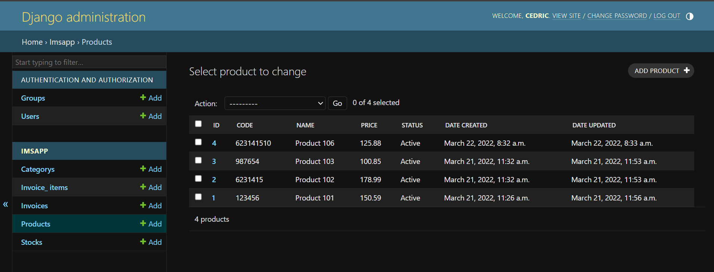
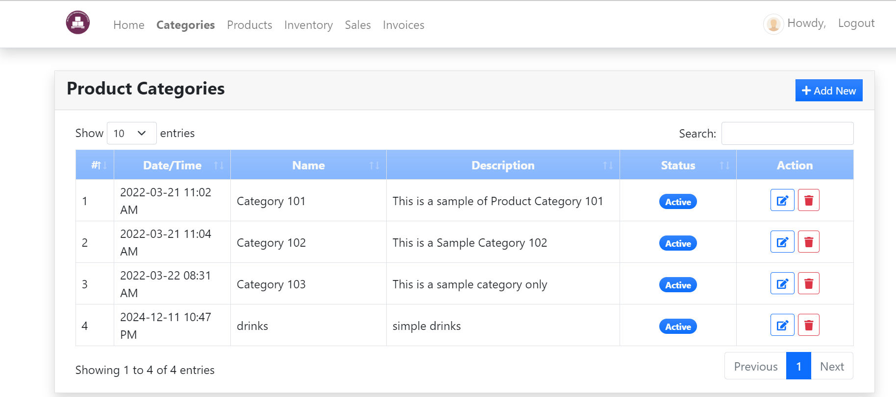
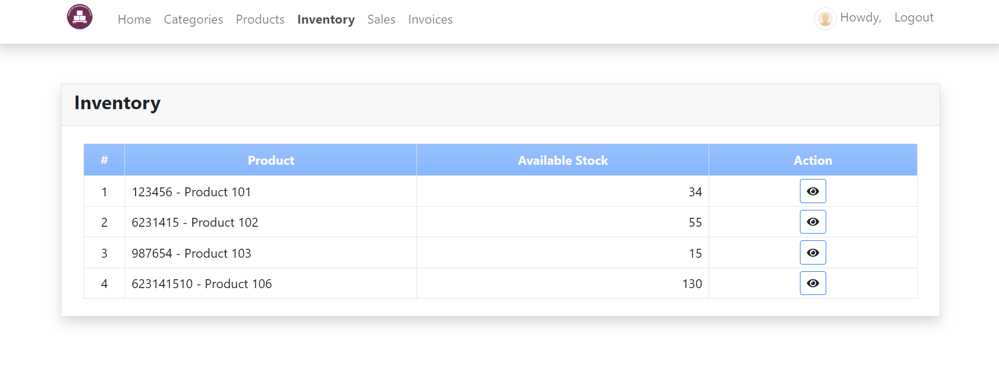
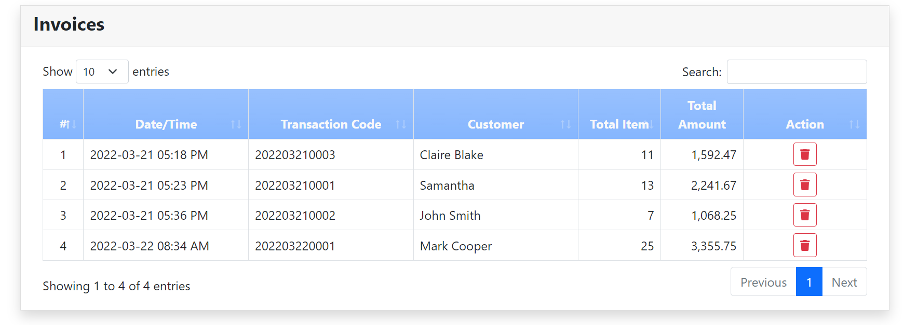

---

# Django Inventory Management System

A web-based inventory management system built with Django, leveraging Bootstrap for styling, JavaScript for dynamic interactions, and Pillow for image processing.

## Table of Contents

- [Features](#features)
- [Technologies Used](#technologies-used)
- [Installation](#installation)
- [Configuration](#configuration)
- [Usage](#usage)
- [Screenshots](#screenshots)
- [License](#license)

---

## Features

- **Inventory Management**: Add, update, and delete items in inventory.
- **Stock Tracking**: Track available quantities and get low-stock alerts.
- **Responsive Design**: Fully responsive UI for all devices, including mobile and desktop.
- **Image Uploading**: Manage product images with support for image processing via Pillow.
- **Dynamic UI**: Interactive components using JavaScript for seamless user experience.
- **Admin Panel**: Customizable Django admin interface for managing inventory and users.

---

## Technologies Used

### Backend

- **Django**: Python-based web framework for rapid development and clean design.
- **Pillow**: Image processing library for handling product images.

### Frontend

- **HTML5**: Markup language for structuring the content.
- **CSS3**: Stylesheets for layout and design.
- **Bootstrap**: CSS framework for responsive and modern design.
- **JavaScript**: For dynamic interactions and real-time updates.

---

## Installation

1. **Clone the repository**:

   ```bash
   git clone https://github.com/hirwacedric123/Django-Inventory-Management-System.git
   cd Django-Inventory-Management-System
   ```

2. **Create a virtual environment**:

   ```bash
   python -m venv venv
   source venv/bin/activate  # On Windows: venv\Scripts\activate
   ```

3. **Install dependencies**:

   ```bash
   pip install -r requirements.txt
   ```

4. **Apply database migrations**:

   ```bash
   python manage.py migrate
   ```

5. **Create a superuser**:

   ```bash
   python manage.py createsuperuser
   ```

6. **Run the server**:

   ```bash
   python manage.py runserver
   ```

7. **Access the application**:

   Open your browser and go to [http://127.0.0.1:8000/](http://127.0.0.1:8000/).

---

## Configuration

### `settings.py`

Make sure to configure the following settings in your `settings.py`:

```python
# settings.py

INSTALLED_APPS = [
    ...,
    'imsApp',  # Your app name
    'django.contrib.admin',
    'django.contrib.auth',
    'django.contrib.contenttypes',
    'django.contrib.sessions',
    'django.contrib.messages',
    'django.contrib.staticfiles',
]

# Pillow image upload configuration
MEDIA_URL = '/media/'
MEDIA_ROOT = BASE_DIR / 'media'

# Static files configuration
STATIC_URL = '/static/'
STATICFILES_DIRS = [BASE_DIR / 'static']
```

### URL Configuration

In your project's `urls.py`:

```python
from django.conf import settings
from django.conf.urls.static import static
from django.contrib import admin
from django.urls import path, include

urlpatterns = [
    path('admin/', admin.site.urls),
    path('', include('inventory.urls')),
] + static(settings.MEDIA_URL, document_root=settings.MEDIA_ROOT)
```

---

## Usage

1. **Add Inventory Items**:
   - Log in to the admin panel at [http://127.0.0.1:8000/admin/](http://127.0.0.1:8000/admin/).
   - Add products with images and stock details.

2. **Manage Inventory**:
   - View, update, or delete items via the inventory management dashboard.

3. **Responsive Design**:
   - The interface adapts to different screen sizes (desktop, tablet, mobile).

---

## Screenshots

### Inventory Dashboard



### Products Page




### Inventory Page



### Invoices page


---

## License

This project is licensed under the MIT License. See the `LICENSE` file for details.

---

## Contributing

Contributions are welcome! Please fork the repository and submit a pull request.

--- 
